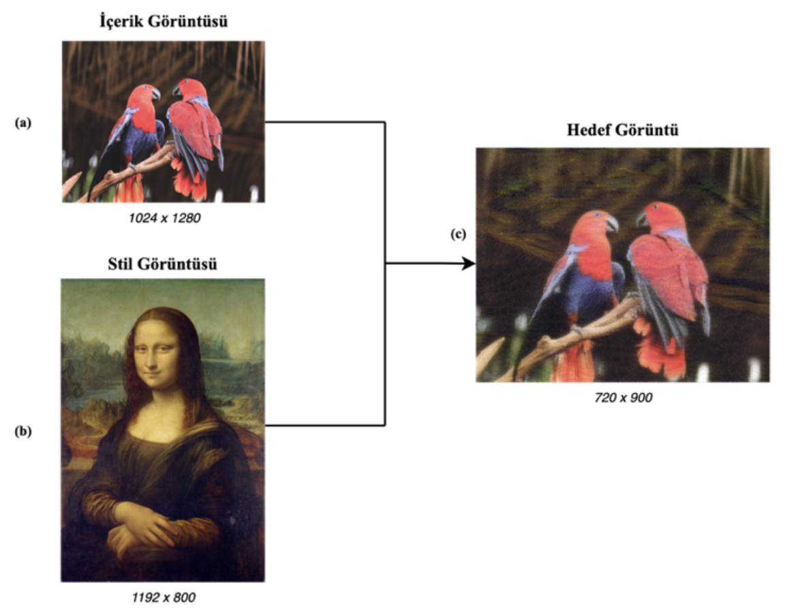
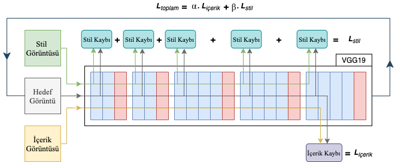
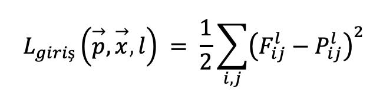
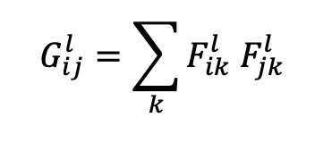
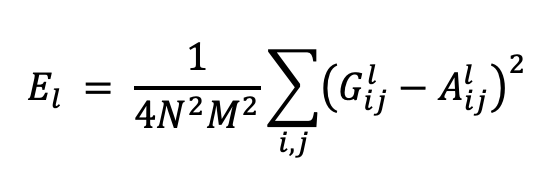
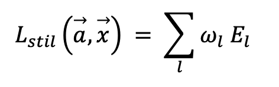
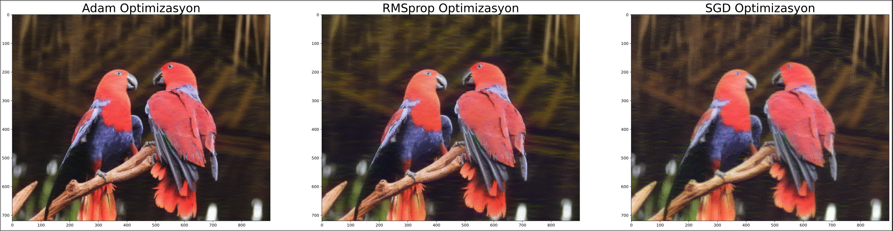
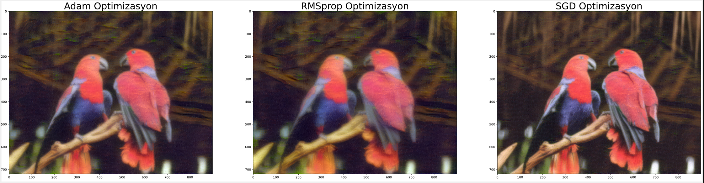

# NST - Neural Style Transfer
 Neural Style Transfer in keras

## Stil aktarımı nedir? && What is the style transfer?
Stil aktarımı, temelinde CNN modeli kullanarak içerik görüntüsünün içeriğini ve stil görüntüsünün stilini (dokusunu) ayırarak, içerik görüntüsüne stili özelliklerinin aktarımını sağlayan ve yeni bir görüntü elde eden bir yöntemdir.

<i>Style transfer is a method that separates the content of the content image and the style (texture) of the style image by using the CNN model on its basis, providing the transfer of style properties to the content image and obtaining a new image.</i>

### Bunu nasıl yapar? && How does it do that?
İki farklı VGG modelini ele alalım

  - VGG16
  - VGG19

Bu iki ağ modeli ile:
  - Derin katmanda elde edilen özniteliği ile içeriğini bulunur ve hedef görüntü ile arasındaki fark bulunur. Bu farka içerik kaybı denilir.
  - Modelin her bloğunda bulunan konvolüsyon katmanınlarındaki stil ve hedef görüntünün özniteliklerine bakılarak stil kaybı bulunur,
  - Hesaplanan iki kayıp değeri toplanır ve güncellenir.
  - Ardından Gradyon iniş yöntemiyle hedef görüntü güncellenerek belirlediğimiz adım sayısında işlem tekrarlanır.
  
<i>Consider two different VGG models

  - VGG16
  - VGG19

With these two network models:
  - Finds the attribute and its content in the deep layer and the difference between it and the target image This difference is called the loss of content.
  - Style loss is found by looking at the style and attributes of the target image in the convolution layers in each block of the model,
  - The two calculated loss values are added up and updated.
  - Then, the target image is updated with the Gradient descent method and the process is repeated for the number of steps we have determined.</i>
  

## Kayıp Fonksiyonları Nasıl Hesaplanır? && How to Calculate Loss Functions?
### İçerik Kaybı && Content Loss
İçerik kaybı yapılan bu uygulamada, VGG modelin son (5.) bloğunda bulunan 2. konvolüsyon aşamasındaki hedef görüntü ile içerik görüntüsü arasındaki fark hesaplanarak bulunur. Amaç hedef görüntünün ne kadar içerik görüntüsüne içerik açısından benzediğini bulmaktır.

<i>In this application with content loss, the difference between the target image in the 2nd convolution stage and the content image in the last (5th) block of the VGG model is calculated and found. The goal is to find out how much the target image resembles the content image in terms of content.</i>

### Stil Kaybı && Style Loss
Stil kaybı, VGG modelin her bloğunda bulunan 1. konvolüsyon aşamasında hesaplanır. Lakin stil kaybını hesaplamadan evvel bir işlem daha uygulamamız gerekmektedir. Bu işlemin adı ise Gram Matrisi bulmaktır. Gram matris korelasyonu bulmakta bize yardımcı olacaktır. 
Gram matris 2 boyutlu görüntünün transpozesi ile çarpılmasıyla bulunur.

<i>Style loss is calculated in the 1st convolution phase in each block of the VGG model. However, we need to apply another process before calculating the style loss. The name of this process is to find the Gram Matrix. Gram matrix will assist us in finding correlation.
The gram matrix is found by multiplying the 2D image by its transpose.</i>

Gram matrisi bulduktan sonra stil kaybını hesaplayabiliriz.

<i>After finding the gram matrix, we can calculate the style loss.</i>

Stil görüntüsünün gram matrisinin hedef görüntünün gram matrisinden farkı hesaplanır.

<i>The difference of the gram matrix of the style image from the gram matrix of the target image is calculated.</i>

Her katmanda elde edilen kayıplar küçük bir değerle güncellenir ve toplanır. Elde edilen son değer ise bizim stil kaybımızdır.

<i>The losses obtained in each layer are updated with a small value and summed up. The last value achieved is our style loss.</i>

### Toplam Kayıp && Total Loss
Bu iki kayıp değeri (içerik ve stil) alfa ve beta değerleri ile güncellenerek toplanır.

<i>These two loss values (content and style) are added up by updating them with alpha and beta values.</i>

## Sonuçlar
### VGG16

### VGG19

