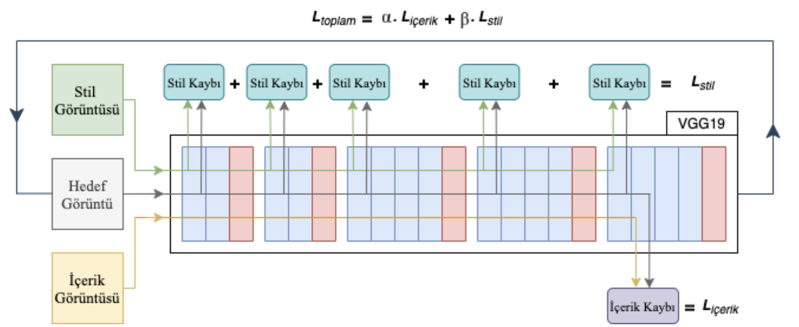

# NST - Neural Style Transfer
 Neural Style Transfer in keras

## Stil aktarımı nedir?
Stil aktarımı, temelinde CNN modeli kullanarak içerik görüntüsünün içeriğini ve stil görüntüsünün stilini (dokusunu) ayırarak, içerik görüntüsüne stili özelliklerinin aktarımını sağlayan ve yeni bir görüntü elde eden bir yöntemdir.

### Bunu nasıl yapar?
İki farklı VGG modelini ele alalım

  - VGG16
  - VGG19

Bu iki ağ modeli ile:
  - Derin katmanda elde edilen özniteliği ile içeriğini bulunur ve hedef görüntü ile arasındaki fark bulunur. Bu farka içerik kaybı denilir.
  - Modelin her bloğunda bulunan konvolüsyon katmanınlarındaki stil ve hedef görüntünün özniteliklerine bakılarak stil kaybı bulunur,
  - Hesaplanan iki kayıp değeri toplanır ve güncellenir.
  - Ardından Gradyon iniş yöntemiyle hedef görüntü güncellenerek belirlediğimiz adım sayısında işlem tekrarlanır.

## Kayıp Fonksiyonları Nasıl Hesaplanır?
### İçerik Kaybı
İçerik kaybı yapılan bu uygulamada, VGG modelin son (5.) bloğunda bulunan 2. konvolüsyon aşamasındaki hedef görüntü ile içerik görüntüsü arasındaki fark hesaplanarak bulunur. Amaç hedef görüntünün ne kadar içerik görüntüsüne içerik açısından benzediğini bulmaktır.

### Stil Kaybı
Stil kaybı, VGG modelin her bloğunda bulunan 1. konvolüsyon aşamasında hesaplanır. Lakin stil kaybını hesaplamadan evvel bir işlem daha uygulamamız gerekmektedir. Bu işlemin adı ise Gram Matrisi bulmaktır. Gram matris korelasyonu bulmakta bize yardımcı olacaktır. 
Gram matris 2 boyutlu görüntünün transpozesi ile çarpılmasıyla ulunur

Gram matrisi bulduktan sonra stil kaybını hesaplayabiliriz.

Stil görüntüsünün gram matrisinin hedef görüntünün gram matrisinden farkı hesaplanır.

Her katmanda elde edilen kayıplar küçük bir değerle güncellenir ve toplanır. Elde edilen son değer ise bizim stil kaybımızdır.

### Toplam Kayıp
Bu iki kayıp değeri (içerik ve stil) alfa ve beta değerleri ile güncellenerek toplanır.

## Sonuçlar
### VGG16

### VGG19

